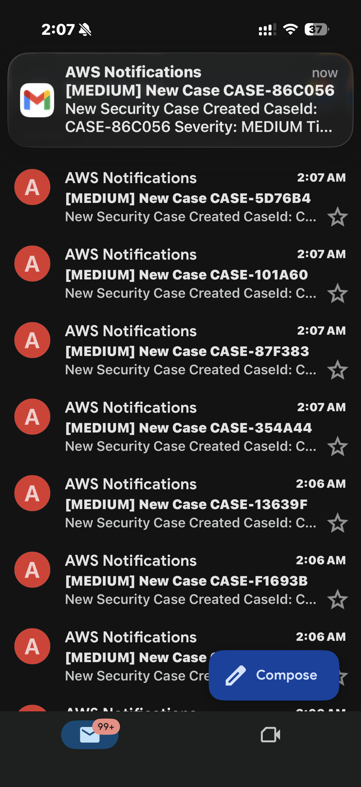

# AWS Security Monitoring and Automated Response System

# Comments
02/12 - Upload updated script. 

## Overview
This project demonstrates a cloud-native security monitoring pipeline built in AWS.

The objective is to detect, monitor, and alert on security findings while supporting controlled, analyst-driven response rather than fully automated remediation. This reflects how many real world security teams validate findings before action while using AWS native services in a real-world architecture.

## Architecture
CloudTrail -> GuardDuty -> Security Hub -> EventBridge -> SNS -> Lambda -> s3 + DynamoDB
## Flow Description
- CloudTrail captures API activity.
- GuardDuty analyzes logs and produces security findings.
- Security Hub aggregates findings.
- EventBridge routes qualifying events.
- SNS distributes alert notifications.
- Lambda performs automated response logic:
- Generates unique Case IDs
- Writes structured evidence artifacts to S3
- Stores metadata in DynamoDB
- Publishes notifications

## Work Completed
- Security Hub enabled
- SNS topic created
- EventBridge rule created to forward findings
- Lambda function created for controlled response workflows
- Evidence artificats written to S3
- Case metadata structured and stored
- CloudWatch montioring verified
- Event pattern configured to filter HIGH and CRITICAL findings

## Next Steps
- Connect EventBridge to Lambda trigger
- Implement automated remediation logic
- Simulate findings and validate alerts
- Create architecture diagram
  ## Intergration Testing Incident (Unintentional Recursive Invocation)
  
- During integration testing, an S3 trigger was configured on the same bucket used to store evidence artifacts.
When Lambda wrote evidence.json to S3 the PutObject event triggered Lambda again creating a recursive invocation loop.
### Live Alert Notification
![Live Alert Notification

## Observed Impact

- 438,000 Lambda invocations
- High SNS notification volume
- Throttling observed
- Async retry behavior visible in CloudWatch
- 400k email notifications generated before mitigation
## Root Cause

- S3 event source was not filtered or isolated from the Lambda output bucket.
- Writing to the same bucket that triggers the function created a self-invoking loop.
## Mitigation Actions Taken

- Reserved concurrency set to 0 (immediate halt)
- S3 trigger removed
- SNS subscription deleted
- Metrics monitored until invocation rate dropped to zero
## Key Lessons Learned
- Never write to the same S3 bucket that triggers the Lambda without prefix filtering
- Always isolate ingestion buckets from artifact buckets
- Monitor CloudWatch invocation spikes immediately
- Understand Lambda async retry and event-source behavior
- Implement guardrails before scaling automation
- This experience provided direct exposure to real-world serverless failure modes and recovery strategies.
## Security Design Principles Applied

- Least privilege IAM policies
- Structured case ID generation
- Immutable evidence storage
- Event-driven architecture
- Observability-first debugging
## Next Improvements

- Add CloudWatch alarm for abnormal invocation spikes
- Add severity-based notification filtering
## Architecture and Infrastructure Screenshots
## Cloudtrail Logging
### CloudTrail Logging

### IAM Role Configuration

### Lambda Environment Variables

### SNS Alert Subscription

## Security Hub
Security Hub enabled and aggregating findings from 
GuardDuty. Configured with AWS Foundational Security 
Best Practices standard.

## EventBridge Rule
Rule: `high-severity-findings`
Filters HIGH and CRITICAL findings and forwards them 
to the case_manager Lambda function automatically.

Real-time SNS notifications firing for each security case:
- MEDIUM findings → Case created + email alert
- HIGH/CRITICAL findings → Case created + S3 evidence 
  + email alert

## Results
- 100+ security cases created in DynamoDB
- Evidence stored in S3 per case
- Real-time email alerts delivered via SNS
- Full audit trail via CloudTrail
- Zero Lambda errors across all executions
- ## Integration Testing - Live Incident Alerts

The system was fully tested end-to-end using both manual 
Lambda test events and GuardDuty sample findings.

### GuardDuty Sample Findings Generated
- 🔴 Critical: 11
- 🟠 High: 155
- 🟡 Medium: 152
- 🟢 Low: 66
- **Total: 384 findings**
- ### GuardDuty Threat Detection
- 
## Compliance Monitoring

In addition to threat detection, the project also includes a **compliance scanning Lambda function** named `compliance_checker`.

This function performs automated checks for AWS configuration issues and generates a compliance report.

When the compliance check runs:

- The Lambda scans AWS configuration results
- A **JSON report** is generated and stored in the S3 bucket under  
  `compliance-reports/`
- An **SNS notification email** is sent with a summary of the findings

During testing, the scanner successfully detected a noncompliant rule:

- `iam-password-policy`

The alert email included the scan timestamp, number of violations, and a link to the full report stored in S3.

This extends the project beyond threat detection and demonstrates how the same event-driven architecture can support **security monitoring, incident alerting, and compliance reporting** within AWS.

---

## Author

**Larry Jordan**  
Cybersecurity / Cloud Security Student

## Author
Larry Jordan  
Cybersecurity / Cloud Security Student

